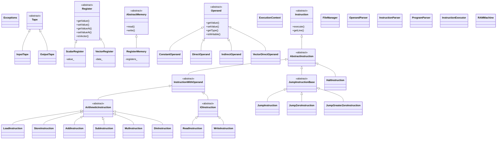

# Simulador de Máquina RAM

Este proyecto implementa un simulador de una máquina RAM. Permite cargar programas escritos en ensamblador RAM, ejecutarlos con una cinta de entrada y generar una cinta de salida

## Jerarquía de clases

